# Explainable cVAE for Antimicrobial Peptide Generation

*Five XAI views onto a peptide generator, plus an external-oracle check.*

*Anastasiia Ozerova, Artem Panov, Alexandr Malyy · April 22, 2026 · [repository](https://github.com/n4rly-boop/explainable-VAE-for-AMP)*

Antimicrobial peptides (AMPs) are short amino-acid sequences, typically 5 to 50 residues, reported to kill bacteria, fungi, viruses, parasites, or tumour cells in laboratory assays. They matter most against multi-drug-resistant strains where small molecules fail. Generative models speed up candidate design, but a black-box sampler that emits `KWKLFKKIEKVGQNVRDGIIK` and labels it "Gram-positive" does not tell a biologist why to synthesise it.

This project makes the "why" explicit. We train a conditional Variational Autoencoder (cVAE) on 5759 curated AMPs from APD6 [13] (CAMPR3 [14] is a complementary database not used here), then attach five XAI views and an external oracle cross-check to the trained latent space. Each view answers a concrete question about what the model learned.

## Task and data

A peptide of length $L$ is a string over the 20-letter amino-acid alphabet $\Sigma$. We tokenise at the residue level with special tokens `<PAD>`, `<SOS>`, `<EOS>`, `<UNK>`, and pad to `max_len=64`. Sequences longer than 62 residues are dropped so every training example retains its `<EOS>` marker; rows with non-canonical symbols (`X`, `U`, `Z`) are dropped.

Activity is multi-label. Each peptide carries a 6-bit condition vector:

$$c \in \{0,1\}^6 = (\text{Gram+}, \text{Gram-}, \text{antifungal}, \text{antiviral}, \text{antiparasitic}, \text{anticancer})$$

A seventh `is_antibacterial` label exists in APD6, but nearly every Gram+ or Gram- peptide also carries it, contributing almost no gradient signal, so we drop it. Rows with no positive label under the 6-label schema are dropped. After cleaning: 5759 peptides, of which 70.8% are Gram+, 74.3% Gram-, 30.1% antifungal, 4.2% antiviral, 5.7% antiparasitic, 5.5% anticancer. Heavy co-occurrence between Gram+ and Gram- is intrinsic to the dataset.

## Model

The architecture is an LSTM encoder and LSTM decoder, with the condition injected at every step.

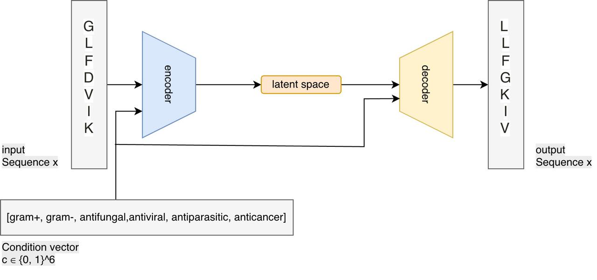
*Figure 1. The encoder reads the residue sequence, concatenates its final hidden state with the condition vector, and projects to $(\mu, \log\sigma^2)$. The sampled $z$ together with $c$ initialises the decoder and is re-concatenated onto each decoder input embedding.*

The encoder is a single-layer LSTM, hidden size 1024, projecting to a 32-dimensional Gaussian. The decoder is asymmetric: hidden size 512, half the encoder's. It initialises its hidden and cell state from $(z, c)$ and re-concatenates $(z, c)$ onto every input embedding (the `z_expand` and `cond_expand` tensors), following [1]. The asymmetric decoder weakens the autoregressive path so the latent variable is actually used — a standard mitigation for posterior collapse [5], [6].

### Training signal

Standard ELBO with three additions:

$$
\mathcal{L} = -\mathbb{E}_{q_\phi(z\mid x,c)}[\log p_\theta(x\mid z,c)] + \beta(t) \cdot \max\!\left(\mathrm{fb},\, \tfrac{1}{d}\sum_{i=1}^{d} \mathrm{KL}(q_\phi \| p)_i\right)
$$

- Cyclical $\beta$ [3]: four cycles of 10 epochs each. $\beta$ ramps from 0 to 1 over the first half of each cycle and holds at 1 for the second. After the four cycles complete, $\beta$ is fixed at 1.0 for all remaining epochs.
- Free bits $\mathrm{fb}=0.25$ per latent dim [2]: a floor on per-dimension KL, giving a hard 8.0-nat floor across 32 dims.
- Word dropout 30% [6] on decoder input tokens, replaced with `<UNK>`.
- Lagging inference [4] for the first ten epochs: five encoder-only updates per decoder update.

All four target posterior collapse, the failure mode where the decoder ignores $z$ and the KL term vanishes. View 3 confirms all 32 latent dimensions stay active.

## Generation

At inference we sample $z \sim \mathcal{N}(0, I)$, fix a target $c$, decode autoregressively with temperature 0.8 and nucleus sampling ($p=0.95$), and reject strings outside the 20-AA alphabet. Gram+ samples look like:

```text
FFGLLGKIASGIAALVKN
GLWNVLKHLL
FLGALAKFAKKVVPSLVKTISKKV
```

Across 250 kept samples per condition: validity 1.00, within-condition uniqueness 1.00, novelty versus training set 0.89 to 0.99 per condition. This is syntactic validity — the strings are peptide-shaped and do not copy training data verbatim. Whether they are biologically useful is what the five views address.

## Five views

### View 0: what does the 32-D latent cloud look like in 2D?

We use t-SNE (`perplexity=50`) for static latent cloud visualisation; UMAP [12] is an alternative manifold method but we found t-SNE gave more coherent one-vs-rest label panels at this dataset size. For placing generated samples on the same cloud (Figure 6) we use a parametric t-SNE [11]: a small MLP $g_\psi : \mathbb{R}^{32} \to \mathbb{R}^2$ fit by MSE against sklearn t-SNE on the training $\mu$ cloud. Interpolation paths (View 1) use PCA, which preserves the even spacing of a straight-line latent interpolation without projection artefacts.

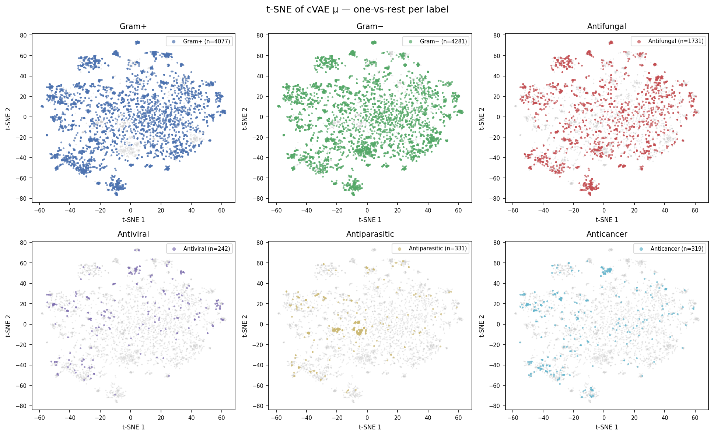
*Figure 2. Real-peptide $\mu$ in t-SNE, one panel per label (positive = coloured, rest = grey). Gram+ and Gram- fill the entire cloud — both are majority labels with heavy co-occurrence. Minority labels show partial concentration but no clean separation.*

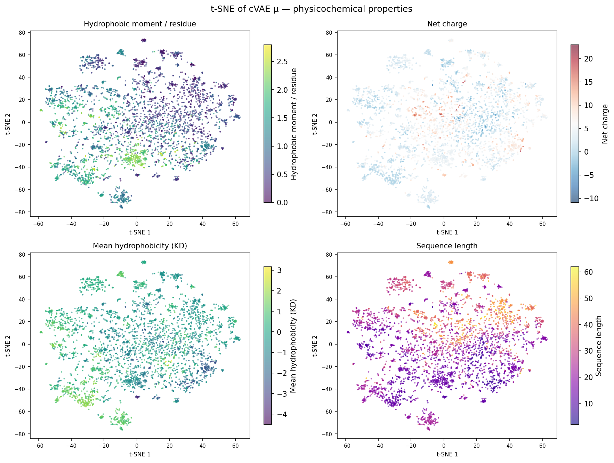
*Figure 3. Same t-SNE cloud coloured by four physicochemical properties. Sequence length shows the clearest gradient: short peptides (~10 residues) concentrate at the bottom, long ones (40–60 residues) toward the upper region. Hydrophobicity (Kyte-Doolittle scale [10]) shows a moderate gradient. Net charge appears nearly uniform — over 70% of AMPs in this dataset have net charge between +2 and +8, so the dynamic range is narrow. Hydrophobic moment (Eisenberg amphipathicity measure [9]) is diffuse across the cloud. These are 2D projections of 32D encodings; the dim-traversal experiments in View 3 are the direct evidence that z encodes these properties.*

The cloud is a uniform blob. Labels do not form distinct regions (Figure 2). This looks like a failure but is the expected outcome of this CVAE design: the decoder receives $c$ directly at every step, so $z$ does not need to encode activity labels for reconstruction to work. KL regularisation pushes $z$ toward $\mathcal{N}(0, I)$, and with 5759 diverse sequences the encoder fills the prior smoothly instead of mapping families to isolated corners.

An earlier checkpoint (Figure 4), trained on 2259 peptides with a β annealing schedule that cycled indefinitely, showed apparent clusters. That checkpoint's encoder had enough capacity to memorise each small training family as a distinct blob. The schedule never fixed β at 1.0, so the KL penalty was periodically near zero and the posterior was never properly regularised. The current model runs four annealing cycles then holds β at 1.0 for all remaining epochs; with 5759 peptides and stable regularisation, the encoder generalises rather than memorises.

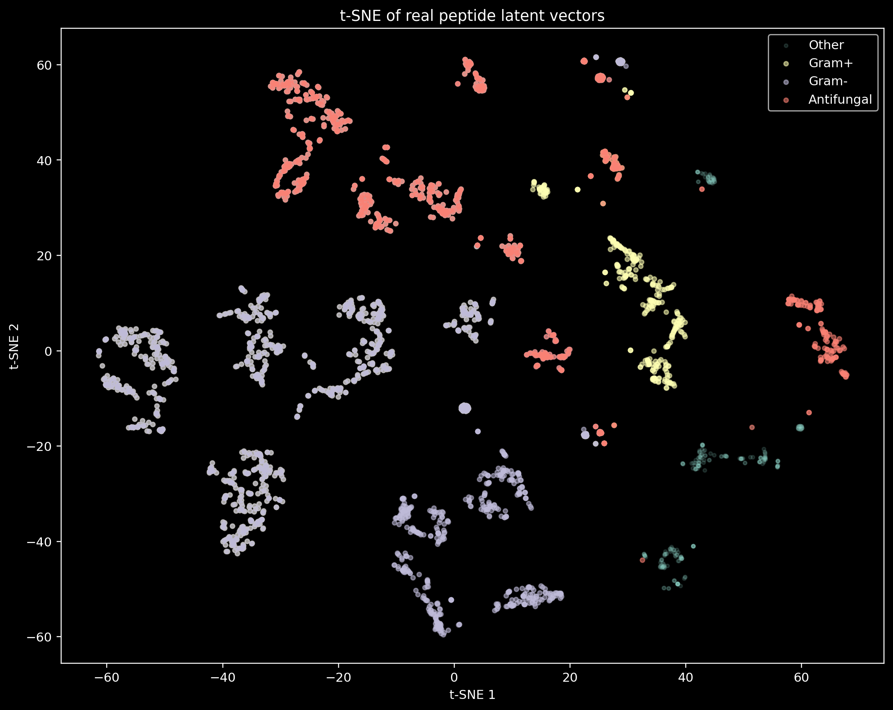
*Figure 4. Earlier checkpoint (2259 peptides, cycling β). Gram+ (salmon) and antifungal (yellow) form isolated blobs. The structure reflects memorized peptide families, not generalisable geometry.*

Activity signal is present in the current model, just diffuse: a linear probe on frozen $\mu$ (logistic regression, test-set macro AUROC 0.75) confirms the encoder does encode activity in $z$. To show that label structure exists in the data and is not absent, we concatenate $[z \| c]$ and vary how much $c$ contributes to pairwise t-SNE distances. Both $z$ and $c$ are standardised independently; then $c$ dims are scaled by a weight before projection. At equal weight, $z$'s 32 dims dominate (84% of all dims) and the cloud stays diffuse. At $c \times 5$, label clusters emerge.

![t-SNE: [z ‖ c] vs [z ‖ c×5]](docs/figures/tsne_ablation_2panel.png)
*Figure 5. Left: $[z \| c]$ equally weighted (38-dim). Right: $[z \| c \times 5]$. Clusters appear only when $c$ dominates, confirming $z$ encodes sequence style and $c$ carries the activity split.*

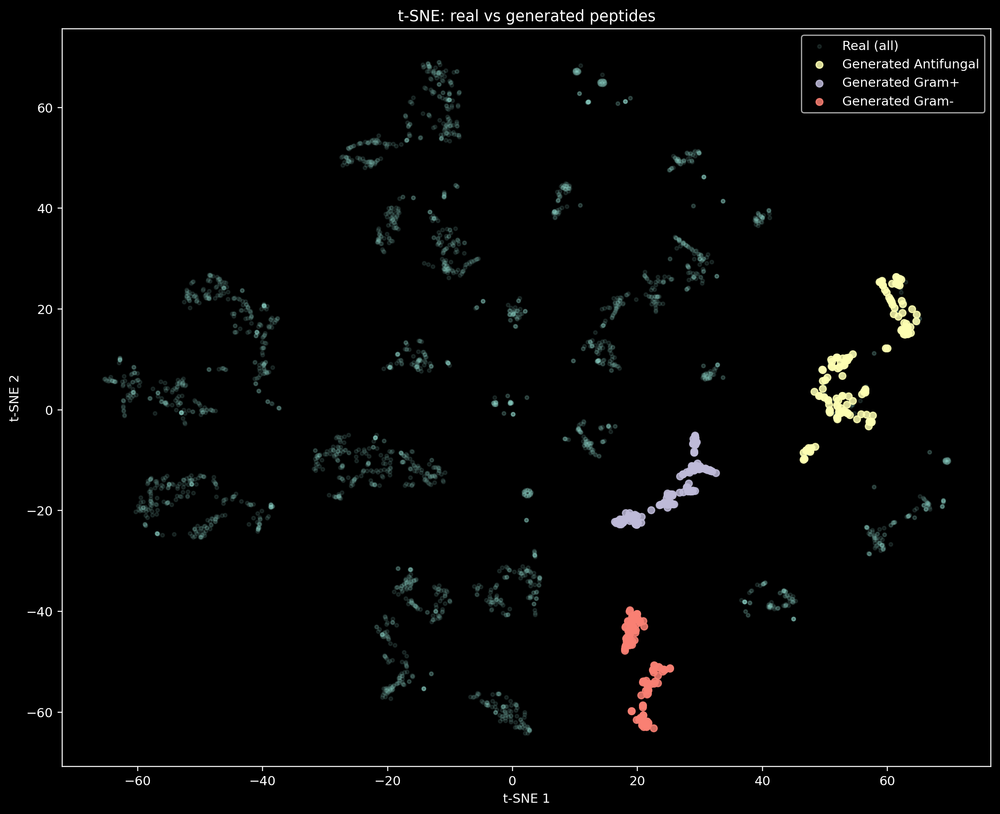
*Figure 6. Generated samples (parametric t-SNE) spread across real support. No collapse to a single mode.*

The projections are compressed pictures, not explanations. Distances are for orientation only; causal claims belong to Views 2 to 4.

### View 1: does moving in latent space produce meaningful sequence change?

Pick two real peptides $x_a$, $x_b$ with opposing activities, take $z_a = \mu(x_a)$, $z_b = \mu(x_b)$, fix a Gram+ condition, and decode along the straight line

$$z_\alpha = (1-\alpha)\, z_a + \alpha\, z_b, \quad \alpha \in \{0, 0.125, \dots, 1\}$$

sampling five peptides per step. Canonical sequences along one Gram+ to Gram- path:

| $\alpha$ | sequence |
|---|---|
| 0.00 | `DFLDTLKNLAKGIGKSLAST` |
| 0.25 | `ILPIVGNLLNGLL` |
| 0.50 | `GFGSPFNQYQCHSHCSGIRGYKGGYCAGLLKLTCTCYRN` |
| 0.75 | `GLTSALKEKLPQSLRVCALFKKQCCKQIFD` |
| 1.00 | `ATCDLLSFTKTGVKASACASACIANRFRGGYCNDKAICVCRN` |

45 distinct sequences across 9 values of $\alpha$ times 5 decodes. None are identical; edit-distance against the training set was not checked, so "distinct" is not "novel".

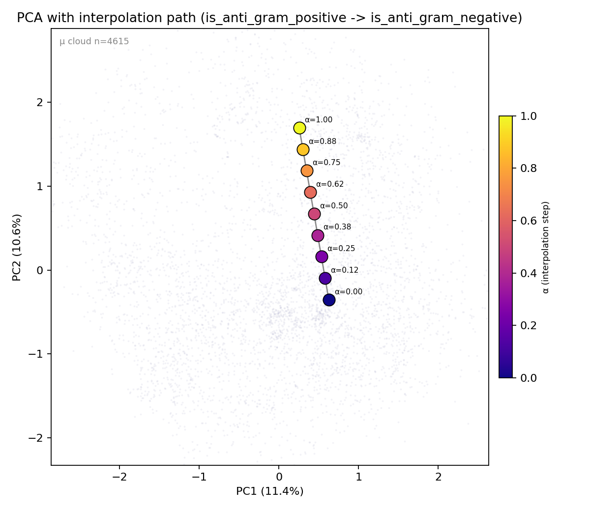
*Figure 7. One Gram+ to Gram- path in PCA (PC1 11.4%, PC2 10.6%). The trajectory spans the second principal component. PCA preserves the even spacing of the linear latent interpolation without distortion.*

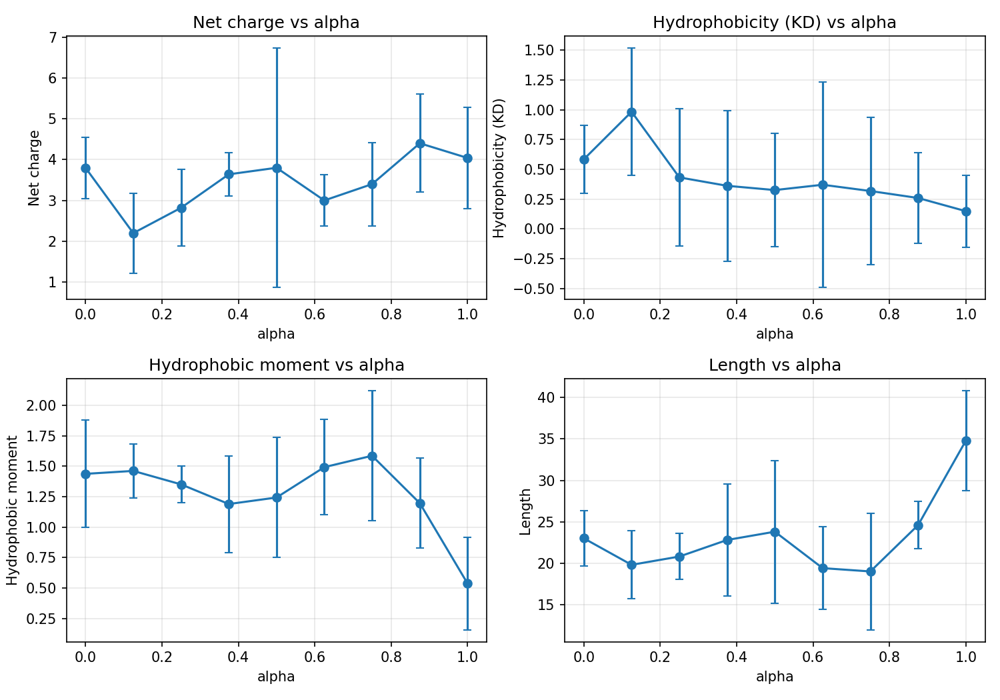
*Figure 8. Mean and standard deviation of four properties along $\alpha$. Net charge rises from ~1 to ~5. Hydrophobic moment falls from 1.72 to 0.41. Length grows from ~15 to ~40 residues. Hydrophobicity is non-monotone — the endpoint is a cysteine-rich peptide with negative mean hydrophobicity.*

The path shifts from a short hydrophobic peptide to a long cysteine-rich one with rising charge. Conditioning stays fixed at Gram+ throughout, so the property change comes from the latent endpoint, not the condition vector.

We also ran condition interpolation: fix $z$, morph $c$ from Gram+ to Gram-. Per-step standard deviation of the hydrophobic moment: 0.43 for latent interpolation, 0.30 for condition interpolation. Latent geometry carries more moment variation than condition shifting alone — $z$ encodes sequence style, $c$ routes activity. Latent space is a biochemistry dial, not a label lookup table.

### View 2: does each label correspond to a direction in latent space?

Following [1], we define one concept vector per label as the centroid difference under $q_\phi$:

$$v_k = \frac{1}{N_k^+}\sum_{i: c_i^{(k)}=1}\mu(x_i) - \frac{1}{N_k^-}\sum_{i: c_i^{(k)}=0}\mu(x_i) \in \mathbb{R}^{32}$$

Concept vectors are computed on the train split only (1811 peptides) to avoid leaking val or test.

| label | $\lVert v_k \rVert$ | $N^+$ | $N^-$ |
|---|---|---|---|
| is_anti_gram_positive | 0.18 | 3265 | 1350 |
| is_anti_gram_negative | 0.20 | 3429 | 1186 |
| is_antifungal | 0.08 | 1389 | 3226 |
| is_antiviral | 0.23 | 196  | 4419 |
| is_antiparasitic | 0.27 | 267  | 4348 |
| is_anticancer | 0.19 | 261  | 4354 |

Magnitude alone is not informative: centroid differences are sensitive to class imbalance (antifungal at 0.08 reflects a near-even 1389/3226 split; antiparasitic at 0.27 is a 267/4348 split where the rare positive centroid drifts further from the bulk). The cosine matrix is more informative:

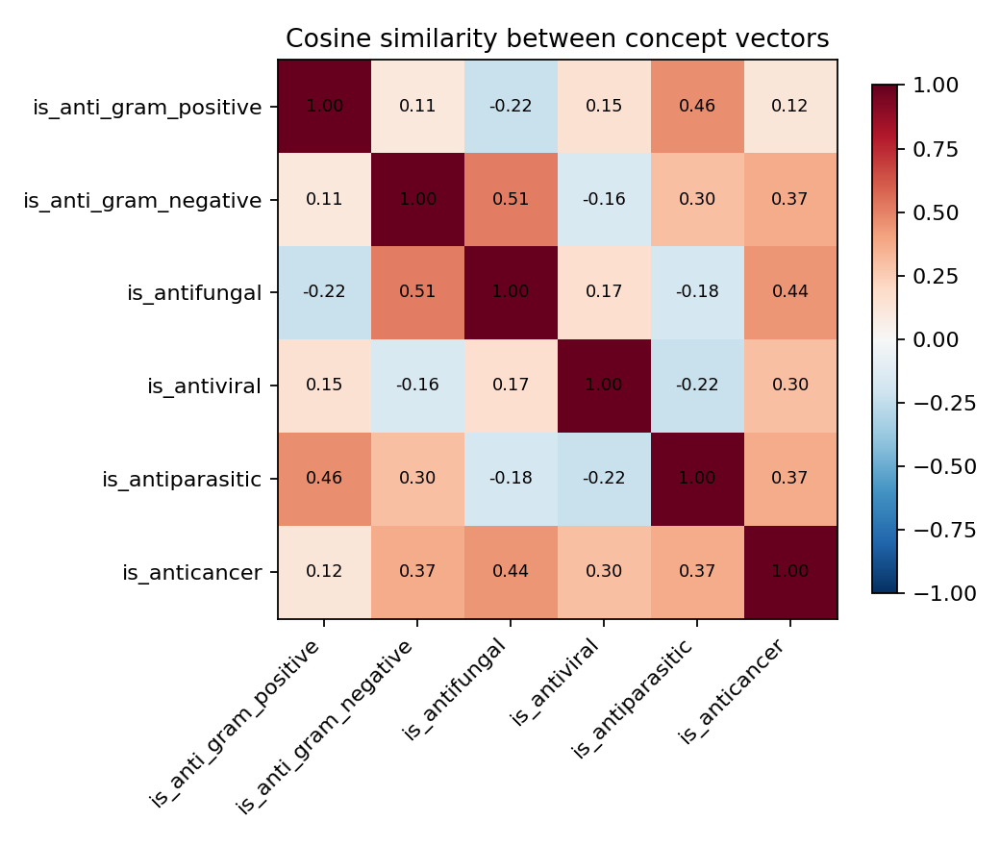

Three patterns:

1. $\cos(v_{\text{Gram-}}, v_{\text{antifungal}}) = 0.51$. The strongest pair. Gram-negative and antifungal AMPs share membrane-disruption mechanisms targeting lipopolysaccharide and ergosterol, respectively, but the same cosine arises when APD6 peptides carry both tags. A permutation test against shuffled labels would separate the two explanations.
2. $\cos(v_{\text{Gram+}}, v_{\text{antiparasitic}}) = 0.46$. Both point in similar directions, consistent with cationic helix-forming peptides active against both targets.
3. Gram+ and Gram- cosine is low (0.11) despite both being majority labels — the model separates their directions even though the two classes heavily overlap.

### View 3: which latent dimensions are alive, and what do they encode?

We use the active-unit metric of [7]: $\mathrm{Var}_i = \mathrm{Var}(\mu_i(x))$ across the dataset, threshold $\mathrm{Var}_i > 0.01$.

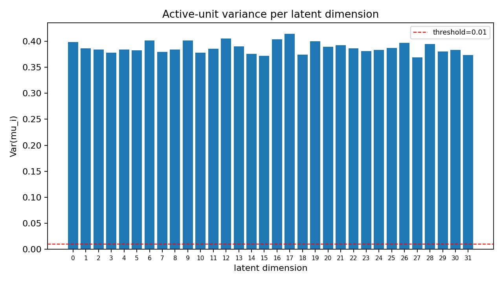
*Figure 9. Per-dimension $\mathrm{Var}(\mu_i)$. All 32 dimensions sit well above 0.01 (minimum 0.19). Posterior collapse is avoided. Per-dim KL or mutual information would be a stricter test — we do not run those here.*

To interpret individual dimensions we freeze a random $z_0$, traverse one dimension over $[-2\sigma_i, +2\sigma_i]$, decode three samples per step, and measure property deltas:

| dim | $\Delta$ charge | $\Delta$ hydro | $\Delta$ moment | $\Delta$ length | dominant |
|---|---|---|---|---|---|
| 12 | 4.10 | 2.13 | 0.93 | 13.0 | charge |
| 6  | 3.67 | 1.20 | 1.09 | 13.3 | moment |
| 9  | 2.63 | 0.80 | 0.79 | 8.3  | moment |
| 16 | 2.60 | 0.83 | 0.54 | 7.0  | charge |
| 17 | 2.03 | 1.18 | 0.93 | 8.3  | moment |

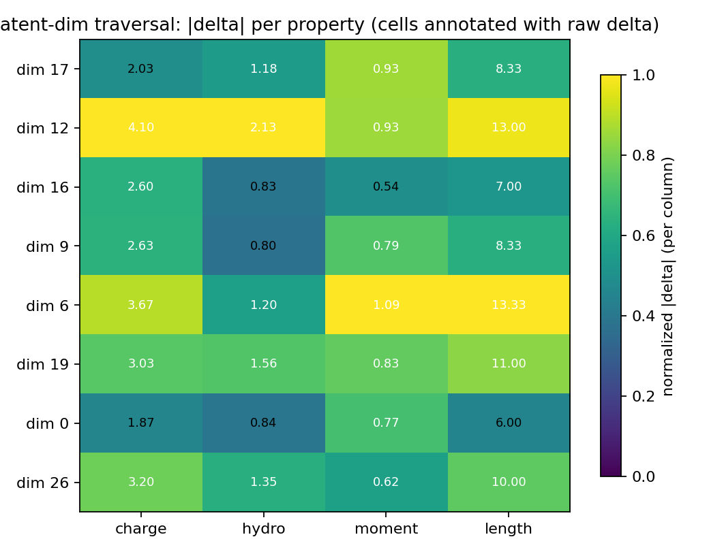

Dim 12 produces the largest charge delta (4.10) and couples strongly with length (Δ=13.0). Dim 6 is the clearest moment axis (Δmoment=1.09); Figure 3 shows this as a diffuse gradient rather than a clean cluster, consistent with moment being entangled across multiple latent dimensions. No dimension is a pure single-property axis, as expected without an explicit disentanglement objective.

### View 4: when the classifier says "Gram+", which residues drive it?

View 4 explains a classifier, not the cVAE itself. We train an auxiliary bidirectional LSTM on the same 6-label schema. Test-set macro AUROC is 0.832 (macro AUPRC 0.630). Per-class AUROC: Gram+ 0.87, Gram- 0.87, antifungal 0.81, antiviral 0.76, antiparasitic 0.88, anticancer 0.80. Rare classes (antiviral, anticancer) have low AUPRC (0.22, 0.23) — their saliency should be read carefully. We attribute predictions to input residues with integrated gradients [8]:

$$\mathrm{IG}_i(x) = (E_i - E_i') \cdot \int_0^1 \frac{\partial F_k}{\partial E_i}\!\left(E' + \alpha(E - E')\right) d\alpha$$

$F_k$ is the classifier logit for label $k$, $E$ the real embedding, $E'$ a zero embedding. We approximate with 32 midpoint steps:

$$\mathrm{IG}_i(x) \approx (E_i - E_i') \cdot \frac{1}{n}\sum_{j=0}^{n-1}\frac{\partial F_k}{\partial E_i}\!\left(E' + \tfrac{j+0.5}{n}(E - E')\right)$$

The midpoint rule has $O(1/n^2)$ discretisation error versus the left or right endpoint rule's $O(1/n)$ on smooth integrands. Per-residue saliency is $\lVert \mathrm{IG}_i \rVert_2$ over the embedding dimension, with PAD / SOS / EOS positions masked.

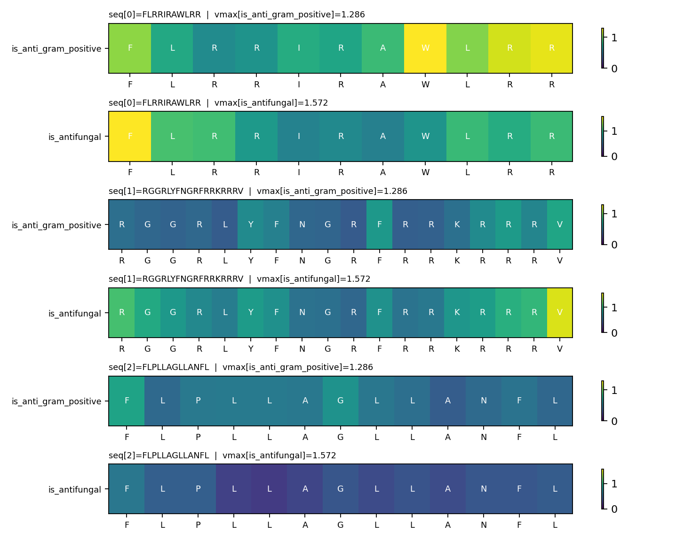
*Figure 10. Per-residue saliency for three generated peptides, attributed for Gram+ and antifungal classifier heads. Row vmax is set per label.*

Per-label maxima for three peptides:

```text
is_anti_gram_positive | FLPLLAGLLANFL      → pos=0  F  sal=0.74
is_anti_gram_positive | FLRRIRAWLRR        → pos=7  W  sal=1.29
is_anti_gram_positive | RGGRLYFNGRFRRKRRRV → pos=17 V  sal=0.75
is_antifungal         | FLPLLAGLLANFL      → pos=0  F  sal=0.63
is_antifungal         | FLRRIRAWLRR        → pos=0  F  sal=1.57
is_antifungal         | RGGRLYFNGRFRRKRRRV → pos=17 V  sal=1.48
```

The classifier weights hydrophobic anchors (F, W, V, L), not cationic K/R. Cationic residues are near-ubiquitous in AMPs so they carry little discriminative signal for this classifier. N-terminal phenylalanine dominates for `FLPLLAGLLANFL` and `FLRRIRAWLRR`; a central tryptophan dominates for the former under Gram+. This is an observation about the classifier, consistent with the amphipathic-helix picture but not a test of it.

**Caveat:** saliency shows what the classifier uses to *discriminate labels*, not what makes a peptide *biologically active*. Real membrane disruption needs both cationic attraction (K/R binding to negatively charged membranes) and hydrophobic insertion (F/W/V/L embedding into the lipid bilayer). The classifier ignores K/R because they are near-universal in the training set — not because they are biologically irrelevant. View 4 explains model reasoning, not biology.

### View 5: does an independent classifier agree?

As an external cross-check we submit 250 generated sequences per condition (all 6 labels plus unconditional) to the public [AIPAMPDS screening server](https://aipampds.pianlab.team/screening) [15], a multi-neural-network ensemble scoring antimicrobial activity against *E. coli* and *S. aureus* plus haemolysis. These sequences come from the current 6-label checkpoint and have no overlap with the AIPAMPDS training data.

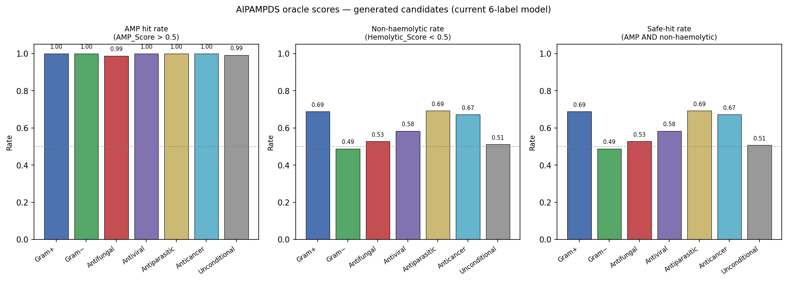
*Figure 11. Left: AMP hit rate (AMP\_Score > 0.5) per condition — near-ceiling for all six labels. Middle: non-haemolytic rate (Hemolytic\_Score < 0.5). Right: safe-hit rate (AMP AND non-haemolytic).*

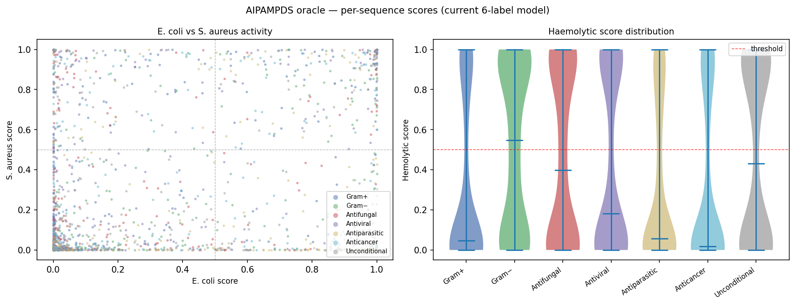
*Figure 12. Per-peptide E. coli versus S. aureus activity score, coloured by condition (left). Right: haemolytic-score distribution per condition.*

Every condition achieves near-100% AMP hit rate, consistent with training exclusively on known AMPs. The discriminating metrics are condition-specific target hit rate and haemolysis. Requested hit rates (Gram+ → S. aureus > 0.5; Gram- → E. coli > 0.5; others → max > 0.5) range from 36% (antifungal) to 64% (antiparasitic). Haemolysis is the binding constraint: non-haemolytic rates of 49–69% drive safe-hit rates to a similar range. Full per-condition numbers:

| Condition | AMP hit | Requested hit | Non-haemolytic | Safe-hit |
|---|---|---|---|---|
| Gram+ | 1.00 | 0.40 | 0.69 | 0.69 |
| Gram− | 1.00 | 0.44 | 0.49 | 0.49 |
| Antifungal | 0.99 | 0.36 | 0.53 | 0.53 |
| Antiviral | 1.00 | 0.44 | 0.58 | 0.58 |
| Antiparasitic | 1.00 | 0.64 | 0.69 | 0.69 |
| Anticancer | 1.00 | 0.47 | 0.67 | 0.67 |
| Unconditional | 0.99 | — | 0.51 | 0.51 |

Antiparasitic shows the highest requested hit rate (0.64), consistent with a more distinct activity profile in the training data (low co-occurrence with Gram+/Gram-). Gram- requested hit rate is lower than Gram+ despite both being majority labels — *E. coli* and *S. aureus* scores are only weakly correlated in the scatter plot.

## Synthesis

| View | Question | Answer |
|---|---|---|
| 0 | What does the latent cloud look like? | Smooth blob by design — z encodes sequence style, c routes activity. Linear probe AUROC 0.75 confirms activity is encoded, just diffuse. Earlier checkpoint's clusters were memorization artifacts from cycling β on 2259 peptides. |
| 1 | Does $z$-geometry encode biochemistry? | Yes: charge rises and moment falls along a Gram+ to Gram- interpolation; latent moment std (0.43) exceeds condition-only std (0.30). |
| 2 | Do labels have latent directions? | Yes, but the strongest cosine (Gram- / antifungal = 0.51) is partly explained by label co-occurrence. |
| 3 | Which dimensions carry what? | All 32 active; dim 12 is the clearest charge axis, dim 6 is the clearest moment axis. |
| 4 | What drives the classifier? | Hydrophobic anchors (F, W, V, L), not cationic K/R. |
| 5 | Does an external model agree? | AIPAMPDS safe-hit rate 0.69 on Gram+, 0.49 on Gram-; antiparasitic highest at 0.69; haemolysis is the binding constraint across all conditions. |

The five views answer different questions. They do not collectively prove the model is correct: View 4 explains the classifier, not the generator; View 2 cannot separate learned directions from label co-occurrence; View 5 agreement is classifier-to-classifier, not wet lab. What they give is five concrete handles a biologist can pull on a candidate sequence, each backed by a figure or a number.

## Limitations

- Saliency explains the external classifier, not the generator. View 4 attributions tell us what the classifier uses to assign a label. They are not attributions on the cVAE's generative decision.
- Concept-vector directions are confounded with label co-occurrence. The Gram- / antifungal cosine of 0.51 is consistent with shared membrane-disruption biology but is also expected when APD6 peptides carry both tags. We do not run a permutation test.
- Class imbalance. The cleaned subset has 4 to 6% positives for antiviral, antiparasitic, and anticancer. Concept-vector magnitudes and the auxiliary classifier (View 4) reflect the same asymmetry: rare-class AUPRC sits at 0.22 to 0.23 even at macro AUROC 0.83.
- Active-units is a weak collapse test. $\mathrm{Var}_i > 0.01$ can miss residual per-dimension collapse. Per-dim KL or mutual-information estimates would be stronger.
- Parametric t-SNE is a regression approximation. We fit $g_\psi$ by MSE against sklearn t-SNE on the training $\mu$ cloud. Distances in the 2D frame are for orientation only.
- Latent dimensions are entangled. Dim 14 and 18 couple length with moment or charge; no dimension is a clean single-property axis. A $\beta$-VAE or Factor-VAE objective would help but was out of scope.
- Small dataset with heavy multi-label overlap. 5759 peptides, with >70% Gram+ / Gram- co-labelling and only 4 to 6% positive support for antiviral, antiparasitic, and anticancer.
- View 5 is classifier-to-classifier. AIPAMPDS agreement confirms the generated sequences look antimicrobial by another model's criteria, not that they are biologically active.
- No wet-lab validation. All results are computational. The next step is synthesising AIPAMPDS safe-hits and measuring MIC against real *E. coli* and *S. aureus* strains.

## Takeaway

The cVAE produces peptide-shaped strings with reasonable coverage of APD6 — not interesting on its own. The five views give a biologist concrete, view-specific questions they can ask about any candidate: which residues does the classifier focus on (View 4), which latent direction shares this activity profile (View 2), which dimension moves the moment (View 3). Each answer is a number or a figure, not a claim.

## References

[1] S. N. Dean and S. A. Walper, "Variational autoencoder for generation of antimicrobial peptides," *ACS Omega*, vol. 5, no. 33, pp. 20746–20754, 2020.

[2] D. P. Kingma, T. Salimans, R. Jozefowicz, X. Chen, I. Sutskever, and M. Welling, "Improving variational inference with inverse autoregressive flow," in *Proc. Adv. Neural Inf. Process. Syst. (NeurIPS)*, 2016.

[3] H. Fu, C. Li, X. Liu, J. Gao, A. Celikyilmaz, and L. Carin, "Cyclical annealing schedule: A simple approach to mitigating KL vanishing," in *Proc. Conf. North Amer. Chapter Assoc. Comput. Linguist. (NAACL)*, 2019.

[4] J. He, D. Spokoyny, G. Neubig, and T. Berg-Kirkpatrick, "Lagging inference networks and posterior collapse in variational autoencoders," in *Proc. Int. Conf. Learn. Represent. (ICLR)*, 2019.

[5] J. Lucas, G. Tucker, R. Grosse, and M. Norouzi, "Don't blame the ELBO! A linear VAE perspective on posterior collapse," in *Proc. Adv. Neural Inf. Process. Syst. (NeurIPS)*, 2019.

[6] S. R. Bowman, L. Vilnis, O. Vinyals, A. M. Dai, R. Jozefowicz, and S. Bengio, "Generating sentences from a continuous space," in *Proc. Conf. Comput. Nat. Lang. Learn. (CoNLL)*, 2016.

[7] Y. Burda, R. Grosse, and R. Salakhutdinov, "Importance weighted autoencoders," in *Proc. Int. Conf. Learn. Represent. (ICLR)*, 2016.

[8] M. Sundararajan, A. Taly, and Q. Yan, "Axiomatic attribution for deep networks," in *Proc. Int. Conf. Mach. Learn. (ICML)*, 2017.

[9] D. Eisenberg, R. M. Weiss, and T. C. Terwilliger, "The helical hydrophobic moment: a measure of the amphiphilicity of a helix," *Nature*, vol. 299, pp. 371–374, 1982.

[10] J. Kyte and R. F. Doolittle, "A simple method for displaying the hydropathic character of a protein," *J. Mol. Biol.*, vol. 157, no. 1, pp. 105–132, 1982.

[11] L. van der Maaten, "Learning a parametric embedding by preserving local structure," in *Proc. Int. Conf. Artif. Intell. Stat. (AISTATS)*, 2009.

[12] L. McInnes, J. Healy, and J. Melville, "UMAP: Uniform manifold approximation and projection for dimension reduction," arXiv:1802.03426, 2018.

[13] G. Wang, X. Li, and Z. Wang, "APD3: the antimicrobial peptide database as a tool for research and education," *Nucleic Acids Res.*, vol. 44, no. D1, pp. D1087–D1093, 2016. [Online]. Available: https://aps.unmc.edu/database

[14] F. H. Waghu, R. S. Barai, P. Gurung, and S. Idicula-Thomas, "CAMPR3: a database on sequences, structures and signatures of antimicrobial peptides," *Nucleic Acids Res.*, vol. 44, no. D1, pp. D1094–D1097, 2016. [Online]. Available: https://camp3.bicnirrh.res.in/

[15] "AIPAMPDS screening server," PianLab. [Online]. Available: https://aipampds.pianlab.team/screening
